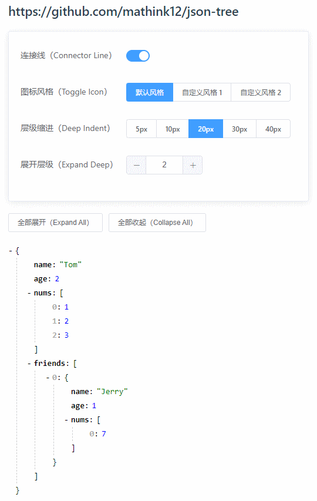

# json-tree-pro

JSON tree view for Vue.


## Installation & Usage

```bash
npm i json-tree-pro
```

```js
// main.js
import Vue from 'vue'
import JsonTree from 'json-tree-pro'
import 'json-tree-pro/lib/JsonTree.css'

Vue.component('JsonTree', JsonTree)
```

```vue
<JsonTree :json-data="{ name: 'Tom', age: 7 }" />
```


## Demo & Docs

|                         GitHub                        |                        Gitee                        |
|-------------------------------------------------------|-----------------------------------------------------|
| [Repository](https://github.com/mathink12/json-tree) | [Repository](https://gitee.com/mathink12/json-tree) |
| [Demo & Docs](https://mathink12.github.io/json-tree/) | [Demo & Docs](http://mathink12.gitee.io/json-tree/) |




## License

[MIT](http://opensource.org/licenses/MIT)
